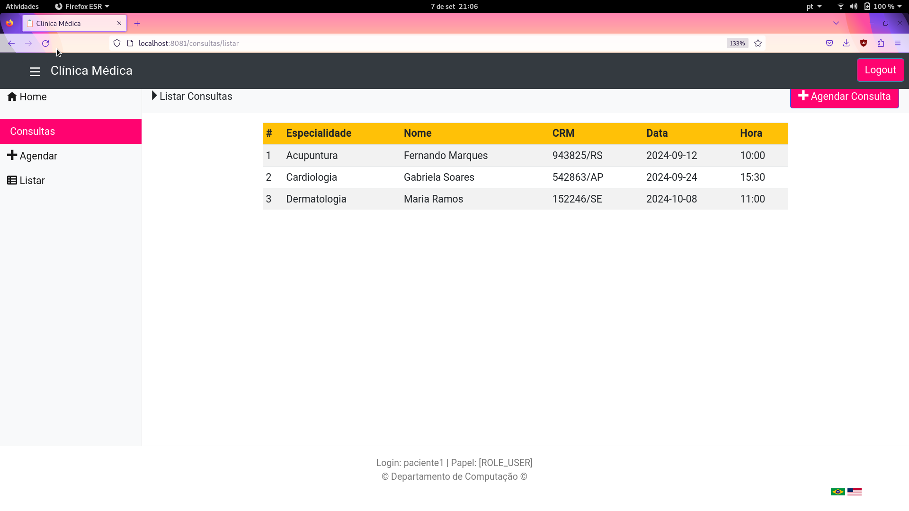

# Sistema web para agendamento de consultas médicas com Spring Boot e Rest API

O sistema foi construído na arquivetura MVC (Model-View-Controller) e usou as seguintes tecnologias: Spring MVC (Controladores Rest), Spring Data JPA, Spring Security e Thymeleaf no lado do servidor e CSS no lado do cliente.

### O sistema oferece três tipos de cadastro:
  - de pacientes, com os seguintes dados: e-mail, senha, CPF, nome, telefone, sexo e data de nascimento;
  - de médicos, com os seguintes dados: e-mail, senha, CRM, nome e especialidade;
  - de consultas, com os seguintes dados: nome do médico, CRM do médico e data/hora da consulta. A duração da consulta é de 30 minutos e sempre inicia-se em "hora cheia" ou "hora meia".

### O sistema possui as seguintes funcionalidades:
  - CRUD de médicos mediante login de administrador;
  - CRUD de pacientes mediante login de administrador;
  - Listagem de todos os médicos em uma única página;
  - Listagem de todos os médicos por especialidade;
  - Agendamento de consulta com um médico meidante login do paciente;
  - Listagem de todas as consultas de um paciente mediante login do paciente;
  - Listagem de todas as consultas de um médico mediante login do médico;
  - Internacionalização em dois idiomas: português e inglês.

### Principais telas:

### Informações para execução local:
  - É necessário ter instalados: Apache Tomcat - versão 9.0.88, e Apache Maven - versão 3.6.3 ou superior;
  - Primeiro, é necessário executar o comando "mvn spring-boot:run" na pasta raiz da aplicação;
  - Depois, a aplicação estará disponível na url "localhost:8081".

### Informações para execução das operações CRUD através de Rest:
  - A execução de operações CRUD em pacientes através de Rest está disponível nas seguintes urls:
      - "localhost/8081/pacientes" + POST: inserção de um novo paciente (CREATE);
      - "localhost/8081/pacientes" + GET: recuperação de todos os pacientes cadastrados (READ);
      - "localhost/8081/pacientes/{id}" + GET: recuperação do paciente com um id específico (READ);
      - "localhost/8081/pacientes/{id}" + PUT: atualização do paciente com um id específico (UPDATE);
      - "localhost/8081/pacientes/{id}" + DELETE: remoção do paciente com um id específico (DELETE);
  - A execução de operações CRUD em médicos através de Rest está disponível nas seguintes urls:
      - "localhost/8081/medicos" + POST: inserção de um novo medico (CREATE);
      - "localhost/8081/medicos" + GET: recuperação de todos os medicos cadastrados (READ);
      - "localhost/8081/medicos/{id}" + GET: recuperação do medico com um id específico (READ);
      - "localhost/8081/medicos/especialidade/{nome}" + GET: recuperação dos medicos com uma especialidade específica (READ);
      - "localhost/8081/medicos/{id}" + PUT: atualização do medico com um id específico (UPDATE);
      - "localhost/8081/medicos/{id}" + DELETE: remoção do medico com um id específico (DELETE);
  - A execução de operações de leitura de consultas através de Rest está disponível nas seguintes urls:
      - "localhost/8081/consultas" + GET: recuperação de todas as consultas cadastradas (READ);
      - "localhost/8081/consultas/{id}" + GET: recuperação da consulta com um id específico (READ);
      - "localhost/8081/consultas/medicos/{id}" + GET: recuperação das consultas de um médico com um id específico (READ);
      - "localhost/8081/consultas/pacientes/{id}" + GET: recuperação das consultas de um paciente com um id específico (READ);
      - consultas podem ser criadas através da aplicação em localhost:8081;

### Outras informações:
  - O banco de dados está populado com 2 administradores, 10 pacientes e 30 médicos;
  - Os logins e senhas dos usuários pré-cadastrados estão no arquivo "ClinicaApplication.java" no caminho "/src/main/java/br/ufscar/dc/dsw/ClinicaApplication.java";

###### Autor: Giovanna Victória Rossetto
###### Data de criação: 07/09/2024 - 7 de setembro de 2024
###### Última modificação: 7/09/2024 - 7 de setembro de 2024
