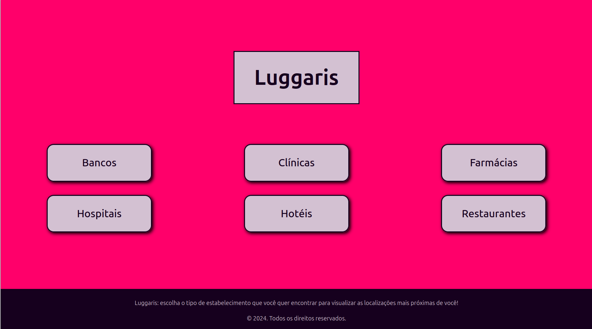
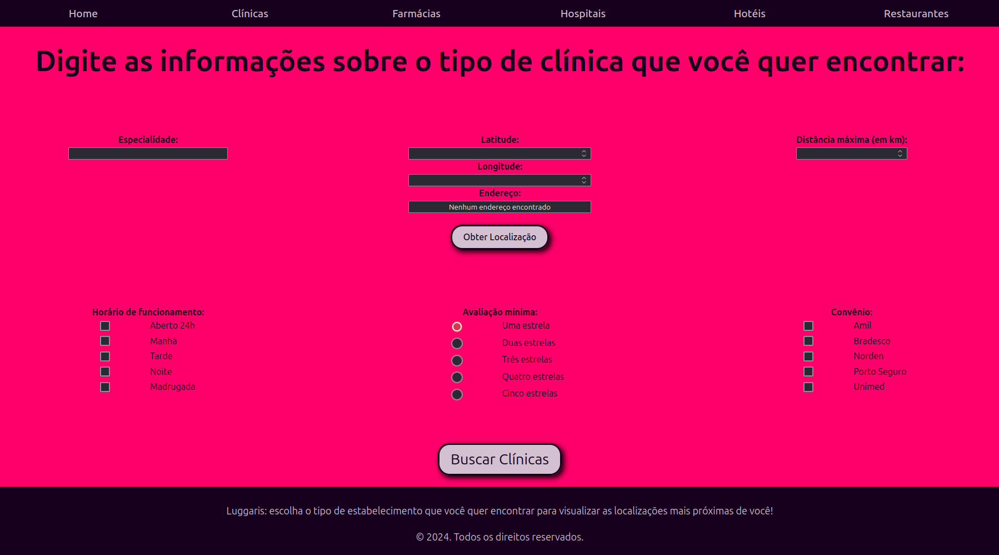
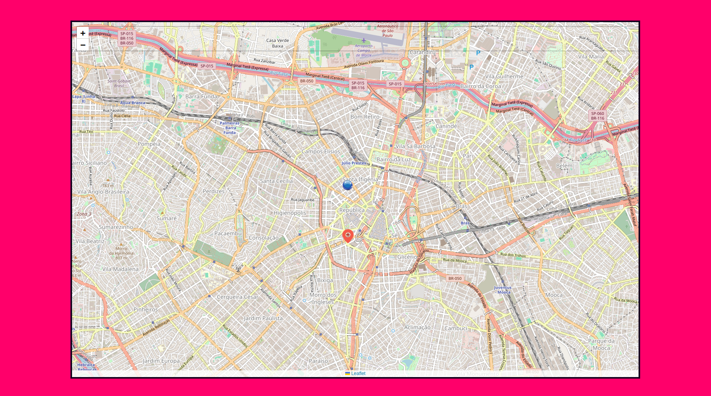

# Luggaris

## An application designed to find the closest establishments to you in a fully personalized way!

### Features
- Allows choosing between different types of establishments, such as Banks, Clinics, Pharmacies, etc. (currently implemented only for Clinics);
- Allows selecting specific characteristics of each establishment, such as opening hours, minimum rating, accepted insurance, and specialty (in the case of Clinics);
- Enables obtaining the user's current address with just one click;
- Alternatively, allows the user to manually enter the desired location;
- Displays a map with the user's chosen location and the locations of the found establishments, along with their characteristics;

### General characteristics
- All pages are responsive for small, medium, and large screens;
- The database is mocked and has been populated with some clinics for testing;
- The entire application follows the SPA (Single Page Application) principle;

### How to test
- Clone the repository locally: `git clone https://github.com/GiovannaVictoria/AcademicProjects.git`
- Enter the project's root folder: `cd AcademicProjects/web/Luggaris-React/`
- Install the application's dependencies: `npm install`
- Start the mocked back-end with the database on port 5000: `npx json-server --watch db.json --port 5000`
- Start the front-end: `npm run dev`
- Open the browser at "localhost:5173"

### Requirements for testing
- node.js version 22.14.0;
- npm version 10.9.2;

### Main pages (principais telas)

###### Author: Giovanna Victória Rossetto
###### Creation date: 12/17/2024 - December 17th, 2024
###### Last modification date: 03/02/2025 - March 2nd, 2025

# Luggaris

## Uma aplicação feita para encontrar os estabelecimentos mais próximos de você de maneira totalmente personalizada!

### Funcionalidades
- Permite escolher entre diferentes tipos de estabelecimentos, como Bancos, Clínicas, Farmácias, etc (atualmente, implementado apenas para Clínicas);
- Permite escolher características específicas de cada estabelecimento, como horário de funcionamento, avaliação mínima, convênio e especialidade (no caso de Clínicas);
- Permite obter o endereço atual do usuário através de apenas um clique;
- Permite, alternativamente, que o usuário digite a localização específica desejada;
- Mostra um mapa com a localização escolhida pelo usuário e as localizações dos estabelecimentos encontrados, assim como suas características;

### Características gerais
- Todas as páginas são responsivas para telas pequenas, médias e grandes;
- O banco de dados é mockado e foi populado com algumas clínicas para teste;
- Toda a aplicação segue o princípio SPA (Single Page Application);

### Como testar
- Clonar o repositório localmente: `git clone https://github.com/GiovannaVictoria/AcademicProjects.git`
- Entrar na pasta raiz do projeto: `cd AcademicProjects/web/Luggaris-React/`
- Instalar as dependências da aplicação: `npm install`
- Subir o back-end mockado pelo banco de dados na porta 5000: `npx json-server --watch db.json --port 5000`
- Subir o front-end: `npm run dev`
- Abrir o navegador no endereço "localhost:5173"

### Requisitos para testar
- node.js versão 22.14.0;
- npm versão 10.9.2;

###### Autor: Giovanna Victória Rossetto
###### Data de criação: 17/12/2024 - 17 de Dezembro de 2024
###### Data da última modificação: 02/03/2025 - 2 de Março de 2025
