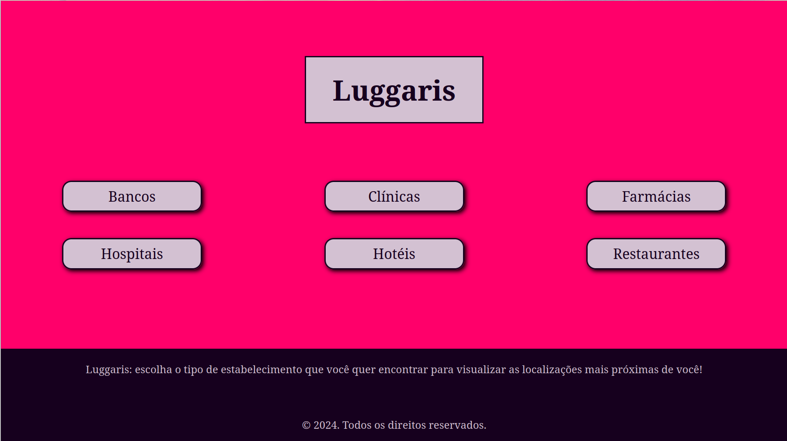
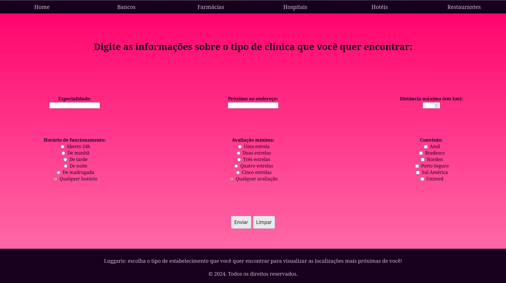
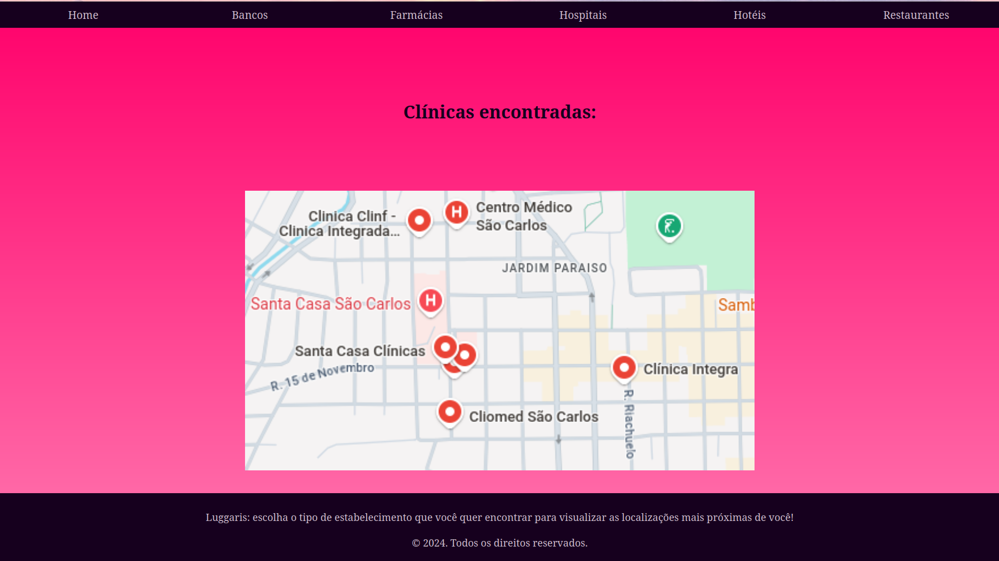

# Luggaris - Uma aplicação para encontrar estabelecimentos próximos a você

Equipe: Giovanna Victória Rossetto - RA 791648

### Sobre a aplicação

O sistema foi construído com HTML e CSS. As telas são responsivas para tamanhos pequenos, médios e grandes.

Luggaris é uma aplicação que permite localizar diferentes tipos de estabelecimentos de forma personalizada de acordo com cada estabelecimento.
Os tipos de estabelecimentos implementados são:
  - bancos;
  - clínicas;
  - farmácias;
  - hotéis;
  - hospitais;
  - restaurantes.

### Funcionalidades oferecidas

Para encontrar clínicas, é possível escolher:
  - a especialidade médica desejada;
  - a avaliação mínima da clínica;
  - o horário de funcionamento;
  - os convênios aceitos;
  - o endereço referência;
  - a distância máxima ao endereço.

O endereço referência pode ser digitado manualmente ou pode ser obtido através de geolocalização.

### Principais telas

###### Autor: Giovanna Victória Rossetto
###### Data de criação: 23/11/2024 - 23 de novembro de 2024
###### Última modificação: 16/12/2024 - 16 de dezembro de 2024
